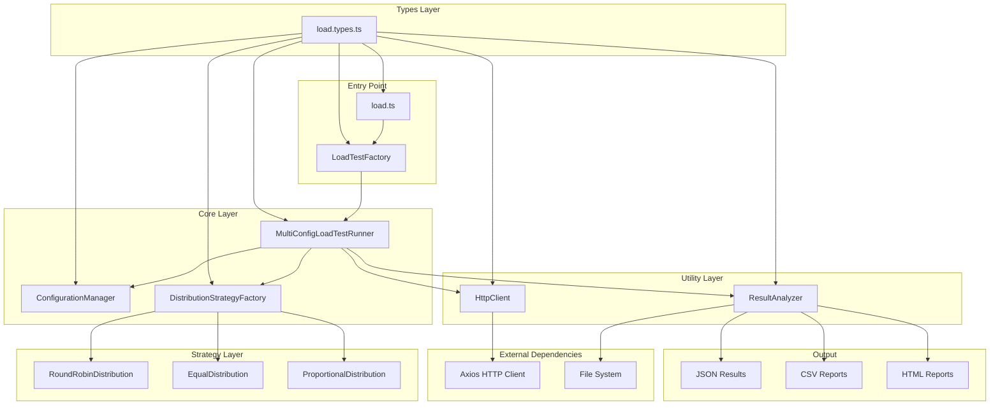
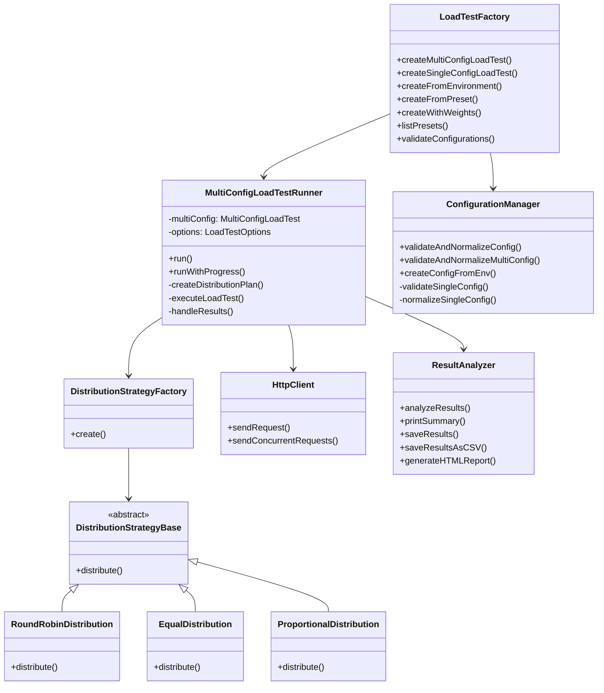
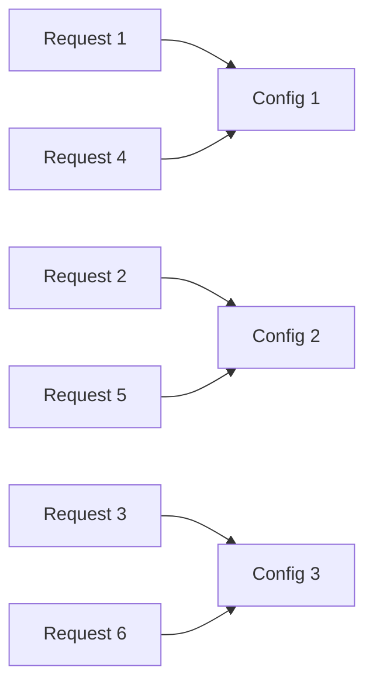
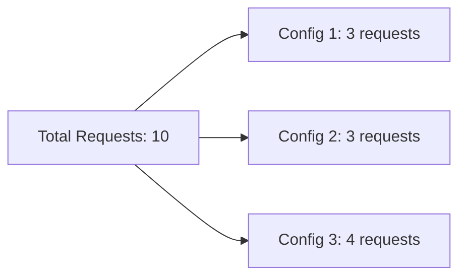
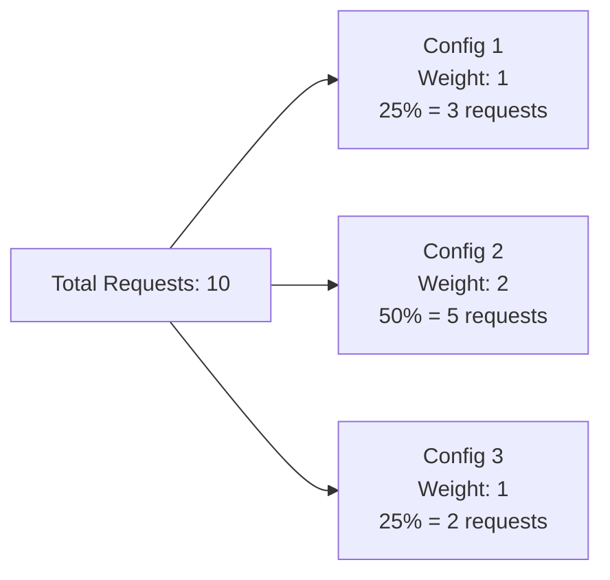
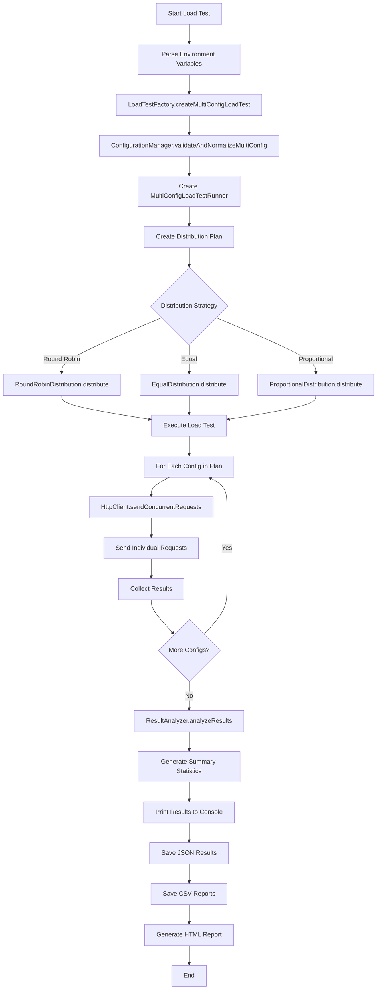
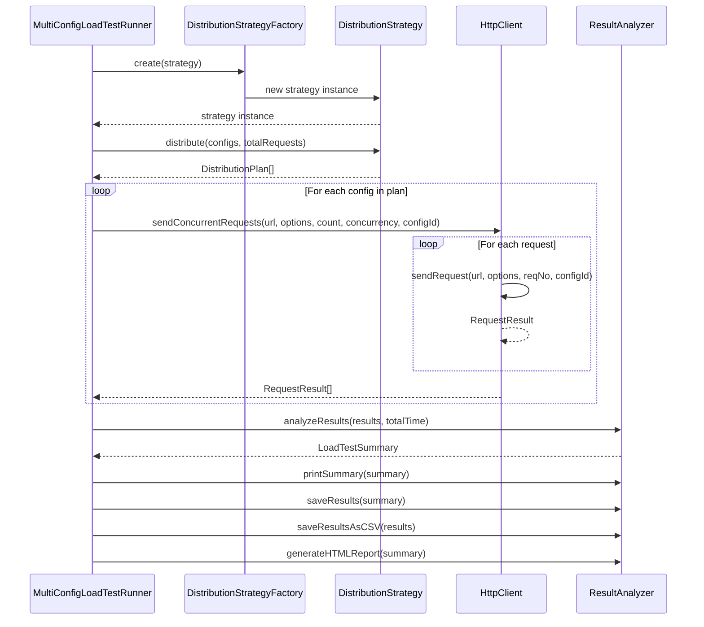

# 🚀 Advanced Load Testing Tool

A comprehensive, enterprise-grade load testing application built with TypeScript, following SOLID principles and design patterns. This tool supports multi-configuration load testing with various distribution strategies, comprehensive result analysis, and detailed reporting.

## 📋 Table of Contents

- [Features](#-features)
- [Architecture](#-architecture)
- [Installation](#-installation)
- [Usage](#-usage)
- [Configuration](#-configuration)
- [Distribution Strategies](#-distribution-strategies)
- [API Reference](#-api-reference)
- [Examples](#-examples)
- [Contributing](#-contributing)

## ✨ Features

- **Multi-Configuration Support**: Test multiple API endpoints simultaneously
- **Flexible Distribution Strategies**: Round-robin, Equal, and Proportional distribution
- **Concurrency Control**: Configurable concurrent request limits per configuration
- **Comprehensive Reporting**: JSON, CSV, and HTML report generation
- **Progress Tracking**: Real-time progress updates during test execution
- **Environment Variable Support**: Configuration via environment variables
- **Preset Configurations**: Pre-defined test configurations for common scenarios
- **TypeScript**: Full type safety and comprehensive documentation
- **SOLID Principles**: Clean, maintainable, and extensible codebase
- **Error Handling**: Robust error handling and validation

## 🏗️ Architecture

The application follows a modular architecture with clear separation of concerns:

### System Architecture Diagram



### Class Hierarchy Diagram



## 📦 Installation

### Prerequisites

- Node.js (v16 or higher)
- pnpm (recommended) or npm

### Install Dependencies

```bash
# Using pnpm (recommended)
pnpm install

# Or using npm
npm install
```

### Build the Project

```bash
# Build TypeScript to JavaScript
pnpm run build

# Or watch mode for development
pnpm run dev
```

## 🚀 Usage

### Basic Usage

```bash
# Run default multi-config test
pnpm run load-test

# Run with progress tracking
pnpm run load-test:progress

# Run single configuration test
pnpm run load-test:single

# Run preset test
pnpm run load-test:preset

# Run weighted distribution test
pnpm run load-test:weighted
```

### Environment Variables

#### Global Test Configuration

| Variable | Description | Default | Example | Required |
|----------|-------------|---------|---------|----------|
| `TEST_TYPE` | Type of test to run | `multi-config` | `single-config`, `multi-config`, `preset`, `environment`, `weighted` | No |
| `TOTAL_REQUESTS` | Total number of requests across all configs | `15` | `100` | No |
| `DISTRIBUTION_STRATEGY` | Distribution strategy | `round_robin` | `round_robin`, `equal`, `proportional` | No |
| `PROGRESS` | Show progress updates during execution | `false` | `true` | No |
| `USE_PRESET` | Preset name for preset tests | - | `pharma-api`, `api-test` | Yes (for preset tests) |
| `CONFIG_IDS` | Comma-separated config IDs for environment tests | `API1,API2` | `API1,API2,API3` | Yes (for environment tests) |

#### Per-Configuration Environment Variables

For environment-based tests, each configuration can be defined using prefixed environment variables:

| Variable Pattern | Description | Default | Example |
|------------------|-------------|---------|---------|
| `{PREFIX}URL` | Target URL for the API endpoint | - | `API1_URL=https://api1.example.com` |
| `{PREFIX}TOTAL_REQUESTS` | Number of requests for this config | `10` | `API1_TOTAL_REQUESTS=20` |
| `{PREFIX}CONCURRENCY` | Max concurrent requests for this config | `5` | `API1_CONCURRENCY=10` |
| `{PREFIX}METHOD` | HTTP method | `GET` | `API1_METHOD=POST` |
| `{PREFIX}WEIGHT` | Weight for proportional distribution | `1` | `API1_WEIGHT=2` |
| `{PREFIX}TIMEOUT` | Request timeout in milliseconds | `30000` | `API1_TIMEOUT=60000` |
| `{PREFIX}HEADER_{HEADER_NAME}` | HTTP headers (replace `{HEADER_NAME}` with actual header) | - | `API1_HEADER_AUTHORIZATION=Bearer token123` |

#### Legacy Configuration (for backward compatibility)

| Variable | Description | Default | Example |
|----------|-------------|---------|---------|
| `URL` | Single URL for legacy single-config tests | Pharma API URL | `https://api.example.com` |
| `CONCURRENCY` | Legacy concurrency setting | `10` | `15` |

#### Environment Variable Examples

**Example 1: Multi-Config Test with Round-Robin**
```bash
export TEST_TYPE=multi-config
export TOTAL_REQUESTS=50
export DISTRIBUTION_STRATEGY=round_robin
export PROGRESS=true
```

**Example 2: Environment-Based Configuration**
```bash
# API1 Configuration
export API1_URL="https://api1.example.com/users"
export API1_TOTAL_REQUESTS="20"
export API1_CONCURRENCY="10"
export API1_METHOD="GET"
export API1_HEADER_AUTHORIZATION="Bearer token123"
export API1_HEADER_CONTENT_TYPE="application/json"

# API2 Configuration  
export API2_URL="https://api2.example.com/posts"
export API2_TOTAL_REQUESTS="15"
export API2_CONCURRENCY="8"
export API2_METHOD="POST"
export API2_HEADER_AUTHORIZATION="Bearer token456"
export API2_HEADER_CONTENT_TYPE="application/json"

# Test Configuration
export TEST_TYPE=environment
export CONFIG_IDS=API1,API2
export TOTAL_REQUESTS=35
export DISTRIBUTION_STRATEGY=proportional
```

**Example 3: Preset Test with Custom Settings**
```bash
export TEST_TYPE=preset
export USE_PRESET=pharma-api
export TOTAL_REQUESTS=100
export PROGRESS=true
```

**Example 4: Weighted Distribution Test**
```bash
export TEST_TYPE=weighted
export TOTAL_REQUESTS=40
export PROGRESS=true
```

### Advanced Usage Examples

#### Command Line Usage

```bash
# Multi-config test with round-robin distribution
TEST_TYPE=multi-config TOTAL_REQUESTS=50 DISTRIBUTION_STRATEGY=round_robin pnpm run start

# Preset test with progress tracking
TEST_TYPE=preset USE_PRESET=pharma-api PROGRESS=true TOTAL_REQUESTS=100 pnpm run start

# Environment-based configuration
TEST_TYPE=environment CONFIG_IDS=API1,API2,API3 TOTAL_REQUESTS=30 pnpm run start

# Weighted distribution test
TEST_TYPE=weighted TOTAL_REQUESTS=40 pnpm run start

# Single config test with custom settings
TEST_TYPE=single-config TOTAL_REQUESTS=25 PROGRESS=true pnpm run start

# Equal distribution test
TEST_TYPE=multi-config DISTRIBUTION_STRATEGY=equal TOTAL_REQUESTS=60 pnpm run start
```

#### Using .env File

Create a `.env` file in your project root:

```bash
# .env file example
TEST_TYPE=environment
TOTAL_REQUESTS=50
DISTRIBUTION_STRATEGY=proportional
PROGRESS=true

# API1 Configuration
API1_URL=https://jsonplaceholder.typicode.com/posts
API1_TOTAL_REQUESTS=20
API1_CONCURRENCY=10
API1_METHOD=GET
API1_WEIGHT=2
API1_HEADER_CONTENT_TYPE=application/json

# API2 Configuration
API2_URL=https://jsonplaceholder.typicode.com/users
API2_TOTAL_REQUESTS=15
API2_CONCURRENCY=8
API2_METHOD=GET
API2_WEIGHT=1
API2_HEADER_CONTENT_TYPE=application/json

# API3 Configuration
API3_URL=https://jsonplaceholder.typicode.com/comments
API3_TOTAL_REQUESTS=15
API3_CONCURRENCY=8
API3_METHOD=GET
API3_WEIGHT=1
API3_HEADER_CONTENT_TYPE=application/json

# Test Configuration
CONFIG_IDS=API1,API2,API3
```

Then run:
```bash
pnpm run start
```

#### Docker Environment Variables

```bash
# Using Docker with environment variables
docker run -e TEST_TYPE=preset \
           -e USE_PRESET=pharma-api \
           -e TOTAL_REQUESTS=100 \
           -e PROGRESS=true \
           your-load-test-image
```

#### CI/CD Pipeline Example

```yaml
# GitHub Actions example
- name: Run Load Test
  run: |
    export TEST_TYPE=environment
    export TOTAL_REQUESTS=200
    export DISTRIBUTION_STRATEGY=round_robin
    export PROGRESS=true
    
    # API1 Configuration
    export API1_URL=${{ secrets.API1_URL }}
    export API1_TOTAL_REQUESTS=100
    export API1_CONCURRENCY=20
    export API1_HEADER_AUTHORIZATION=${{ secrets.API1_TOKEN }}
    
    # API2 Configuration
    export API2_URL=${{ secrets.API2_URL }}
    export API2_TOTAL_REQUESTS=100
    export API2_CONCURRENCY=20
    export API2_HEADER_AUTHORIZATION=${{ secrets.API2_TOKEN }}
    
    export CONFIG_IDS=API1,API2
    npm run load-test
```

#### Environment Variable Validation

The application validates environment variables and provides helpful error messages:

```bash
# Missing required variable for preset test
TEST_TYPE=preset pnpm run start
# Error: USE_PRESET environment variable is required for preset tests
# Available presets: api-test, pharma-api

# Invalid distribution strategy
DISTRIBUTION_STRATEGY=invalid pnpm run start
# Error: Invalid distribution strategy

# Missing URL for environment config
TEST_TYPE=environment CONFIG_IDS=API1 API1_TOTAL_REQUESTS=10 pnpm run start
# Error: Configuration API1: URL is required and must be a non-empty string
```

#### Environment Variable Troubleshooting

**Common Issues:**

1. **Missing Required Variables**: Ensure all required variables are set for your test type
2. **Invalid Values**: Check that numeric values are valid numbers and enums match expected values
3. **Header Format**: Use `PREFIX_HEADER_HEADERNAME` format for custom headers
4. **URL Validation**: URLs must be valid HTTP/HTTPS URLs
5. **Concurrency Limits**: Concurrency cannot exceed total requests per configuration

**Debug Mode:**
```bash
# Enable debug logging (if implemented)
DEBUG=true pnpm run start
```

## ⚙️ Configuration

### Load Test Configuration Interface

```typescript
interface LoadTestConfig {
  id: string;                    // Unique identifier
  totalRequests: number;         // Number of requests for this config
  concurrency: number;           // Max concurrent requests
  url: string;                   // Target URL
  headers: Record<string, string>; // HTTP headers
  method?: 'GET' | 'POST' | 'PUT' | 'DELETE' | 'PATCH';
  body?: string;                 // Request body
  weight?: number;              // Weight for proportional distribution
  timeout?: number;              // Request timeout in ms
}
```

### Multi-Configuration Setup

```typescript
interface MultiConfigLoadTest {
  configs: LoadTestConfig[];           // Array of configurations
  totalRequests: number;               // Total requests across all configs
  distributionStrategy: DistributionStrategy; // Distribution strategy
  globalConcurrency?: number;          // Global concurrency limit
}
```

## 🔄 Distribution Strategies

### 1. Round-Robin Distribution

Distributes requests in a round-robin fashion: `1,2,3,1,2,3...`



**Example**: 10 requests, 3 configs → Config1: 4 requests, Config2: 3 requests, Config3: 3 requests

### 2. Equal Distribution

Distributes requests equally among all configurations.



**Example**: 10 requests, 3 configs → Config1: 3 requests, Config2: 3 requests, Config3: 4 requests

### 3. Proportional Distribution

Distributes requests based on configuration weights.



**Example**: 10 requests, Config1(weight:1), Config2(weight:2), Config3(weight:1) → Config1: 3 requests, Config2: 5 requests, Config3: 2 requests

## 📊 Load Test Flow Diagram



## 📈 Request Execution Flow



## 🛠️ API Reference

### LoadTestFactory

Main factory class for creating load test instances.

#### Methods

- `createMultiConfigLoadTest(configs, totalRequests, distributionStrategy, options?)` - Create multi-config load test
- `createSingleConfigLoadTest(config, options?)` - Create single config load test
- `createFromEnvironment(configIds, totalRequests, distributionStrategy, options?)` - Create from environment variables
- `createFromPreset(presetName, totalRequests, options?)` - Create from preset configuration
- `createWithWeights(configs, totalRequests, options?)` - Create with proportional distribution
- `listPresets()` - List available preset configurations
- `validateConfigurations(configs)` - Validate configuration array

### MultiConfigLoadTestRunner

Main orchestrator for multi-configuration load tests.

#### Methods

- `run()` - Execute load test without progress tracking
- `runWithProgress()` - Execute load test with progress tracking

### HttpClient

HTTP client utility for making requests.

#### Methods

- `sendRequest(url, options, reqNo, configId)` - Send single HTTP request
- `sendConcurrentRequests(url, options, totalRequests, concurrency, configId)` - Send multiple concurrent requests

### ResultAnalyzer

Result analysis and reporting utility.

#### Methods

- `analyzeResults(results, totalExecutionTimeMs)` - Analyze results and generate summary
- `printSummary(summary)` - Print summary to console
- `saveResults(summary, filename?, outputDir?)` - Save results as JSON
- `saveResultsAsCSV(results, filename?, outputDir?)` - Save results as CSV
- `saveConfigSummariesAsCSV(summaries, filename?, outputDir?)` - Save config summaries as CSV
- `generateHTMLReport(summary, filename?, outputDir?)` - Generate HTML report

## 📝 Examples

### Example 1: Basic Multi-Config Test

```typescript
import { LoadTestFactory, DistributionStrategy } from './src/core/loadTestFactory';

const configs = [
  {
    id: 'api1',
    url: 'https://api.example.com/users',
    totalRequests: 10,
    concurrency: 5,
    method: 'GET',
    headers: { 'Content-Type': 'application/json' }
  },
  {
    id: 'api2',
    url: 'https://api.example.com/posts',
    totalRequests: 10,
    concurrency: 5,
    method: 'GET',
    headers: { 'Content-Type': 'application/json' }
  }
];

const runner = LoadTestFactory.createMultiConfigLoadTest(
  configs,
  20, // Total requests
  DistributionStrategy.ROUND_ROBIN
);

await runner.run();
```

### Example 2: Weighted Distribution Test

```typescript
const weightedConfigs = [
  {
    id: 'heavy-api',
    url: 'https://api.example.com/heavy',
    totalRequests: 20,
    concurrency: 10,
    weight: 3 // Higher weight = more requests
  },
  {
    id: 'light-api',
    url: 'https://api.example.com/light',
    totalRequests: 20,
    concurrency: 10,
    weight: 1 // Lower weight = fewer requests
  }
];

const runner = LoadTestFactory.createWithWeights(weightedConfigs, 40);
await runner.runWithProgress();
```

### Example 3: Environment-Based Configuration

```bash
# Set environment variables
export API1_URL="https://api1.example.com"
export API1_TOTAL_REQUESTS="20"
export API1_CONCURRENCY="10"
export API1_HEADER_AUTHORIZATION="Bearer token123"

export API2_URL="https://api2.example.com"
export API2_TOTAL_REQUESTS="15"
export API2_CONCURRENCY="8"
export API2_HEADER_AUTHORIZATION="Bearer token456"

# Run test
TEST_TYPE=environment CONFIG_IDS=API1,API2 TOTAL_REQUESTS=35 npm run start
```

## 📊 Output Files

The application generates several output files:

- `results.json` - Complete test results in JSON format
- `results.csv` - Detailed results in CSV format
- `config-summaries.csv` - Per-configuration summary statistics
- `report.html` - Comprehensive HTML report

### Sample Output Structure

```json
{
  "totalRequests": 20,
  "successful": 18,
  "failed": 2,
  "averageTimeMs": 245.5,
  "minTimeMs": 120,
  "maxTimeMs": 450,
  "totalExecutionTimeMs": 5000,
  "requestsPerSecond": "4.00",
  "details": [...],
  "resultsByConfig": {
    "api1": [...],
    "api2": [...]
  },
  "configSummaries": {
    "api1": {
      "configId": "api1",
      "totalRequests": 10,
      "successful": 9,
      "failed": 1,
      "successRate": 90.0,
      "averageTimeMs": 230.0,
      "minTimeMs": 120,
      "maxTimeMs": 400
    }
  }
}
```

## 🧪 Available Presets

### api-test
- Tests JSONPlaceholder APIs (posts, users)
- Round-robin distribution
- Good for basic API testing

### pharma-api
- Tests pharmaceutical department API
- Equal distribution
- Includes authentication headers

## 🔧 Development

### Project Structure

```
src/
├── load.ts                    # Main entry point
├── types/
│   └── load.types.ts         # Type definitions
├── core/
│   ├── loadTestFactory.ts    # Factory pattern implementation
│   ├── multiConfigLoadTestRunner.ts  # Main orchestrator
│   └── configurationManager.ts       # Configuration validation
├── strategies/
│   └── distributionStrategy.ts       # Distribution strategies
├── utils/
│   ├── httpClient.ts         # HTTP client utility
│   └── resultAnalyzer.ts     # Result analysis utility
└── config/
    └── loadTest.config.ts    # Default configuration
```

### Design Patterns Used

1. **Factory Pattern** - `LoadTestFactory` for creating different types of load tests
2. **Strategy Pattern** - `DistributionStrategy` implementations for different distribution algorithms
3. **Template Method Pattern** - Abstract `DistributionStrategyBase` with concrete implementations
4. **Dependency Injection** - Services injected into main orchestrator
5. **Single Responsibility Principle** - Each class has a single, well-defined responsibility

### SOLID Principles Implementation

- **S** - Single Responsibility: Each class has one reason to change
- **O** - Open/Closed: Open for extension (new strategies), closed for modification
- **L** - Liskov Substitution: All strategy implementations are interchangeable
- **I** - Interface Segregation: Small, focused interfaces
- **D** - Dependency Inversion: Depend on abstractions, not concretions

## 🤝 Contributing

1. Fork the repository
2. Create a feature branch (`git checkout -b feature/amazing-feature`)
3. Commit your changes (`git commit -m 'Add some amazing feature'`)
4. Push to the branch (`git push origin feature/amazing-feature`)
5. Open a Pull Request

### Development Guidelines

- Follow TypeScript best practices
- Write comprehensive JSDoc comments
- Maintain test coverage
- Follow SOLID principles
- Use meaningful variable and function names

## 📄 License

This project is licensed under the ISC License - see the [LICENSE](LICENSE) file for details.

## 🙏 Acknowledgments

- Built with TypeScript for type safety
- Uses Axios for robust HTTP client functionality
- Follows enterprise-grade design patterns
- Comprehensive error handling and validation
- Extensible architecture for future enhancements
